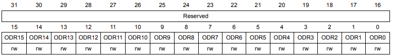

# Обработка данных DMA

* NUCLEO-F401RE
* STM32F401RET6U
* ARM Cortex M4
* CMSIS
* STM32 CubeIDE v1.13.2

>Настройка Direct Memory Access (DMA) с использованием регистров на примере обработки прерываний при приеме данных через UART (Universal Asynchronous Receiver-Transmitter).


```c
#define SIZE 8 // размер буфера

uint8_t buf[SIZE]; //исходный буфер, куда будет передавать данные DMA с регистра USART->DR

uint8_t recieve_buf[2*SIZE]; // главный буфер , куда будут копироваться данные из исходного буфера при приеме половины, а также полного приема всех данных соответствуя установленным размерам исходного буфера 

uint8_t i = 0; // счетчик, который будет определять с какого места будут передаваться данные в главном буфере , если пришла половина данных от исходного буфера,
```
## Инициализация:
* Настройка UART (USART1_Init)
* Инициализация DMA (DMA_Init).
* Конфигурация DMA с указанием исходного адреса (адрес регистра данных USART->DR), адреса назначения (адрес буфера buf) и размера данных RXSIZE.
  
### Настройка UART

```c
void USART1_Init(void){

	RCC->AHB1ENR |= RCC_AHB1ENR_GPIOAEN; // Включаем тактирование порта A
	GPIOA->MODER |= GPIO_MODER_MODER5_0; // PIN в режиме push-pull
	GPIOA->MODER |= GPIO_MODER_MODER10_1; // Устанавливаем режим альтернативной функции для пина PA10 (RX)

	// Выбираем альтернативную функцию 7 (USART1) для пина PA10 RX
	GPIOA->AFR[1] |= (GPIO_AFRH_AFSEL10_2 | GPIO_AFRH_AFSEL10_1 | GPIO_AFRH_AFSEL10_0); 

	RCC->APB2ENR |= RCC_APB2ENR_USART1EN; // Включаем тактирование USART1
	USART1->BRR = 0x683; // Устанавливаем скорость передачи 9600 бод при частоте 16 МГц
	USART1->CR1 |= (USART_CR1_RE | USART_CR1_RXNEIE); // разрешили прием данных и прерывание по приему данных
	USART1->CR3 |= (USART_CR3_DMAR); // включает режим DMA для приема данных
	USART1->CR1 |= USART_CR1_UE; // Включаем USART1
}
```
### Инициализация DMA (DMA_Init):
В MCU встроено два контроллера DMA (DMA1 и DMA2), и у каждого из них есть два порта - один порт для **периферийных устройств** и один порт для **памяти**. Оба контроллера могут работать одновременно.
<p align="center">

</<p align="center">

>Интерфейс программирования AHB slave для DMA обеспечивает программный доступ к регистрам и настройкам DMA-контроллера, позволяя управлять его работой. 

В каждом из двух контроллеров DMA имеется по 8 потоков (stream), всего в сумме получается 16. Каждый из потоков выделяется для обслуживания запросов доступа к памяти одного или большего количества периферийных устройств.
<p align="center">

</<p align="center">

> На потоке может быть одновременно активен только один канал/запрос. Больше одного разрешенного потока не должно обслуживать один и тот же запрос периферийного устройства.  Если есть несколько каналов DMA, каждый из них может быть настроен на обслуживание различных запросов от различных периферийных устройств, но не одновременно.

Каждый из потоков имеет всего до 8 выбираемых каналов (запросов). Этот выбор конфигурируется программно, что позволяет нескольким периферийным устройствам инициировать запросы DMA. Рис.

Таблица показывает отображение DMA2 запросов МК. Эти таблицы дают доступную конфигурацию потоков/каналов DMA против запросов периферийных устройств.
<p align="center">

</<p align="center">

У каждого порта DMA имеется арбитр для обработки приоритетов между разными потоками DMA. Приоритет потока конфигурируется программно (всего имеется 4 уровня приоритета). Если 2 или большее количество потоков DMA имеют одинаковый уровень приоритета, то используется аппаратный приоритет (поток 0 имеет приоритет над потоком 1).

Адреса источника и назначения. Транзакция DMA определяется адресом источника и адресом назначения. Оба этих адреса должны быть в пределах диапазонов шин AHB и APB, и адрес должен быть выровнен на размер транзакции.

Режим транзакции. DMA может осуществлять 3 разных режима передачи:

* Из периферийного устройства в память.
* Из памяти в периферийное устройство.
* Из области памяти в другую область памяти (такой режим передачи может реализовать только DMA2, и в нем не дозволяются режимы circular и direct).

Должно быть определено значение **размера транзакции**, когда контроллером потока является DMA. Фактически это значение определяет объем данных, которые должны быть перемещены из источника (source) в место назначения (destination).

Размер транзакции определяется значением в регистре **DMA_SxNDTR** и шириной данных периферийного устройства. В зависимости от принятого запроса , значение размера транзакции уменьшается на количество переданных данных.

Размер транзакции определяется значением в регистре DMA_SxNDTR и шириной данных периферийного устройства. В зависимости от принятого запроса (burst или single), значение **размера транзакции** уменьшается на **количество переданных данных**.

Можно сконфигурировать DMA так, что в каждой транзакции данных будет автоматически инкрементироваться адрес источника и/или места назначения (source address, destination address).

Ширина данных источника и места назначения. Ширина (разрядность) данных может быть определена следующим образом:
* Byte (байт, 8 бит).
* Half-word (половина слова, 16 бит).
* Word (слово, 32 бита).

Существуют следующие типы (режимы) передач DMA:

* Circular mode: в этом режиме доступна обработка кольцевых буферов и непрерывных потоков данных (тогда регистр DMA_SxNDTR перезагружается автоматически ранее запрограммированным значением).

* Normal mode: как только значение регистра DMA_SxNDTR достигнет 0, поток запрещается (бит EN в регистре DMA_SxCR становится равным 0).

```c
void DMA_Init(void){

	RCC->AHB1ENR |= RCC_AHB1ENR_DMA2EN; // тактирование блока DMA
	DMA2_Stream2->CR = DMA_SxCR_CHSEL_2  ; //4 канал
	DMA2_Stream2->CR &= ~DMA_SxCR_MSIZE;// MSIZE 8 bit
	DMA2_Stream2->CR &= ~DMA_SxCR_PSIZE; // PSIZE 8 bit
	DMA2_Stream2->CR |= DMA_SxCR_MINC;  // Не увеличиваем память
	//DMA2_Stream5->CR |= (0x0<<9); // Не увеличиваем адрес периферии
	DMA2_Stream2->CR &= ~(3UL<<6);  // Из переферии в память
	DMA2_Stream2->CR |= DMA_SxCR_CIRC ;//Circular mode
	DMA2_Stream2->CR |= DMA_SxCR_HTIE; // Прерывание по передаче половины данных
    DMA2_Stream2->CR |= DMA_SxCR_TCIE; // Прерывание по передаче всех данных
    DMA2_Stream2->CR |= DMA_SxCR_TEIE; // Прерывание по ошибке передаче данных
}

```
### Настройка DMA
Конфигурация  DMA с указанием исходного адреса (адрес регистра данных UART), адреса назначения (адрес буфера buf) и размера данных SIZE.

```c
void DMA_Config(uint32_t perih_address, uint32_t mem_address , uint8_t data_amount ){

	DMA2_Stream2->NDTR = data_amount;

	DMA2_Stream2->PAR = perih_address;

	DMA2_Stream2->M0AR = mem_address;

	DMA2_Stream2->CR |= DMA_SxCR_EN;
}
```
>Включение DMA происходит только после того, как мы инициализировали GPIO и USART. И не надо его выключать и включать после, он уже работает в цикле.

## Функция main()
```c
    USART1_Init(); // инициализация USART1
	DMA_Init(); // инициализация DMA
	DMA_Config( (uint32_t) &USART1->DR, (uint32_t) buf, SIZE); // адреса и размер данных для передачи по DMA

	NVIC_EnableIRQ(DMA2_Stream2_IRQn); // включили глобальные прерывания по DMA

    while(1){ // CPU занимается своими делами и ожидает события от DMA 

	}
```

## Обработчик прерываний DMA:

* Определен обработчик прерывания для канала DMA2_Stream2.
  
* В обработчике используется проверка флагов прерывания (Half Transfer Complete и Transfer Complete).
  
* Если установлен флаг Half Transfer Complete, то копируется первая половина буфера buf в основной буфер recieve_buf, и затем флаг прерывания сбрасывается.

* Если установлен флаг Transfer Complete, то копируется вторая половина буфера RxBuf в основной буфер MainBuf, и также сбрасывается соответствующий флаг прерывания.
  
```c
void DMA2_Stream2_IRQHandler(void){ // 
	
	if (READ_BIT(DMA2->LISR, DMA_LISR_HTIF2)){ //проверка флагов прерывания

		memcpy (&recieve_buf[i], &buf[0], SIZE/2); // копируется первая половина буфера buf
		DMA2->LIFCR |= DMA_LIFCR_CHTIF2; // очистили флаг
		i = i+(SIZE/2); // сместили счетчик на половину размера буфера
		if (i>(2*SIZE)-1) i=0; // если вышли за границы буфера, то очищаем счетчик

	}

	if ((READ_BIT(DMA2->LISR, DMA_LISR_TCIF2))){ // передача по 2 каналу завершена полностью

		memcpy (&recieve_buf[i], &buf[SIZE/2], SIZE/2);
		  DMA2->LIFCR |= DMA_LIFCR_CTCIF2; // очистили флаг
		  i = i+(SIZE/2); // сместили счетчик на половину размера буфера
		  if (i>(2*SIZE)-1) i=0; // если вышли за границы буфера, то очищаем счетчик
		  
		}
	}

```
### Функция memcpy

 Функция языка **C**  `memcpy` используется для копирования блока памяти из одного места в другое. Она принимает три аргумента: указатель на область памяти, куда нужно скопировать данные (`&recieve_buf[i]`), указатель на область памяти, откуда нужно скопировать данные (`&buf[0]`), и количество байтов, которые нужно скопировать (`SIZE/2`). Эта функция копирует данные без учета их типа, поэтому она может использоваться для копирования любых данных, хранящихся в памяти.

При приеме половины данных эта функция сначала копирует первую половину буфера `buf` в буфер `recieve_buf`, начиная с позиции `i` , а затем еще раз вызывается при передаче всех данных и копирует вторую половину буфера `buf` в буфер `recieve_buf`. Таким образом, она переносит данные, полученные от USART, в другой массив для дальнейшей обработки. Переменная `i` служит индексом для заполнения буфера `recieve_buf` и изменяется в обработчике прерывания DMA.

Реализация этой функции может выглядеть так:

```c
//Принимает три аргумента: указатель на область памяти, куда нужно скопировать данные (dest), указатель на область памяти, откуда нужно скопировать данные (src), и количество байтов, которые нужно скопировать (n).
void *memcpy(void *dest, const void *src, size_t n)
{
    // Приводим указатели к типу char *, так как char занимает 1 байт
    char *d = (char *)dest; // удобно для копирования данных по байтам
    const char *s = (const char *)src;
    // Копируем n байтов из src в dest по одному
    while (n--)
    {
        *d++ = *s++;
    }
    // Возвращаем указатель на dest
    return dest;
}
```

## Вывод
Мы можем превышать размер буфера принимаемых данных и соответственно размер данных передаваемых по DMA. Например передаем только 8 байт, а обработать можем больше в зависимости от главного буфера. То есть если главный буфер 16 байт , то мы можем через терминал передать 16 байт , хоть DMA передает только 8 байт , с помощью механизма половинной передачи и кольцевому режиму, мы можем не терять данные.

